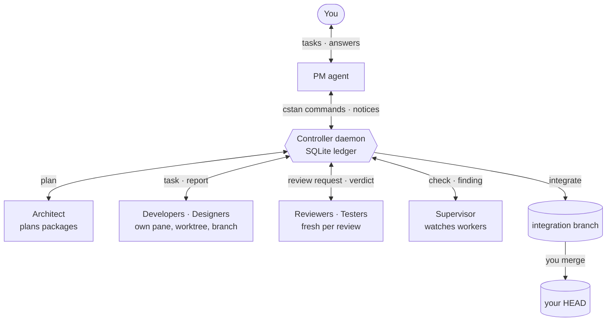

<div align="center">

<picture>
  <source media="(prefers-color-scheme: dark)" srcset="docs/assets/capstan-logo-dark.svg">
  <source media="(prefers-color-scheme: light)" srcset="docs/assets/capstan-logo-light.svg">
  
</picture>

**A controller for a small team of AI coding agents. You talk to one PM; it runs the crew.**


[Quick start](#quick-start) · [How it works](#how-it-works) · [Configuration](#configuration) · [Commands](#command-reference) · [Safety](#safety-model) · [Docs](docs/reference/)

</div>

## What is Capstan

Capstan turns a handful of interactive coding agents into a delivery team. You describe what you want to one agent, the **PM**. The PM spawns workers (developers, designers, reviewers, testers), hands them tasks, collects verified reports, requests independent reviews and tells you which branch to merge.

Every agent is a real interactive session (Claude Code first; Codex and OMP for workers) running in its own Herdr pane and its own git worktree. A separate **controller daemon** carries every message between agents and records every workflow fact in a SQLite ledger. Completion is never guessed from terminal text, and nothing reaches your main branch unless you merge it.

Everything is driven through one command: `cstan`.

## Features

| Feature | What you get |
| --- | --- |
| **PM and worker roles** | One PM talks to you. Workers are free-named roles of four kinds: PM, Developer, Verifier, Supervisor. |
| **A worktree per agent** | Each worker gets its own pane, worktree and branch (`capstan/<agent-id>-g<n>`), cut from your HEAD. |
| **Delivered, acknowledged messages** | One FIFO per recipient. Messages wait while a worker is busy and stay blocked until acknowledged; problems reach the PM with the exact `cstan resolve` to run. |
| **Verified reports** | A report names a full commit id; the controller checks it lies on that worker's branch before the PM hears about it. |
| **Independent reviews** | `request-review` starts a fresh Verifier at the reported commit. It answers once, pass or findings, and is ended. |
| **Integrate, confirm, discard** | Reviewed reports are squashed onto `capstan/integration/<id>` without a checkout. You merge; the controller confirms it is in HEAD. |
| **Planned work tiers** | An optional Architect splits normal and high-risk work into packages with owned files, dependencies and acceptance criteria. High-risk plans get their own review. |
| **Supervisor and findings** | A Supervisor watches active workers and raises findings with evidence, a requested correction and a done-when; unresolved ones escalate. |
| **Operator** | An optional role that proposes shell commands or a controller restart. Nothing runs without a hash-bound PM approval, a session grant or time-boxed full auto. |
| **Prompt relay** | When a worker stops at a permission prompt, the PM shows you the exact prompt and types only the answer you pick. |
| **Researcher with MCP servers** | An optional web-research role with WebSearch, read-only curl and a headless Playwright browser, writing one sourced report. |
| **Replace and lost agents** | Lost panes are detected and reported. `cstan replace` starts a successor seeded from the ledger on a branch at its last accepted report. |
| **Defaults per role kind** | Set a model and permission mode once per kind; a role's own value wins. |
| **Env pass-through and worktree hooks** | Name extra variables for agents; run a `setup` command in each new worktree and a `teardown` before removal. |
| **Nexora tracking** | The PM can mirror requirements and packages into Nexora; the ledger keeps the links and shows drift. |
| **Dashboard** | `cstan dash` is a read-only terminal dashboard of agents, pipeline, queue and findings. |

## How it works



1. **You ask the PM.** It picks a tier. Small work goes straight to a developer; normal and high-risk work goes to the Architect first, which submits a plan of work packages (high-risk plans are reviewed before they are final).
2. **Workers build.** Each commits on its own branch, never pushes or merges, and runs `cstan report <commit> "<summary>"`. The controller verifies the commit before anyone is told.
3. **Reviews are independent.** A fresh reviewer is spawned at the reported commit. Findings go back to the developer, who amends and reports again.
4. **Integration is mechanical.** Reviewed reports are squashed onto an integration branch without touching your checkout. A conflict leaves nothing behind and becomes a new task.
5. **You merge.** After the integration passes its own review you merge it, and `cstan integrate confirm` tells the controller to clean up.

Meanwhile the Supervisor watches for stuck workers, and the controller reports stalled, blocked and lost agents to the PM. The full step-by-step behaviour is in [How Capstan works](docs/reference/workflow.md).

## Quick start

**Requirements:** Node.js 24 (`>=24 <25`), git, Herdr for the panes, and Claude Code (the host the starter config uses).

```sh
git clone <this repository> capstan && cd capstan
npm install
npm run build        # compiles to dist/ and copies migrations
npm link             # puts the cstan binary (dist/src/cli.js) on your PATH
```

Then, in the root of the git repository you want the team to work on:

```sh
cstan init            # creates .capstan/ and a starter capstan.toml
cstan config check    # validates capstan.toml and prints the resolved config
cstan start           # starts the controller and launches the PM in Herdr
cstan dash            # optional: watch the team
```

Switch to the PM's Herdr pane and tell it what you want built. `cstan stop` shuts the controller down.

> [!NOTE]
> `cstan init` adds `/.capstan/` to the repository's local git exclude. The folder holds the ledger and the operator key (`0600`); keep it out of commits.

## Configuration

`cstan init` writes a commented starter `capstan.toml`. Keys are checked strictly: an unknown key is an error. A trimmed example:

```toml
schema_version = 1

[limits]
max_workers = 3                 # workers active at once (PM excluded), at most 16

[layout]
spawn = "pane"                  # or "tab"
pm_width_percent = 60

[supervision]
enabled = true
check_seconds = 300

[worktree]
setup = "npm install"           # runs once in each new worktree
# teardown = "..."              # runs before a worktree is removed

[defaults.Developer]            # per role kind; a role's own value wins
model = "claude-sonnet-5-5"
permission_mode = "acceptEdits"

[env]
pass = ["NEXORA_API_KEY"]       # extra variables copied into every agent

[hosts.claude]
kind = "claude"

[roles.pm]
kind = "PM"
host = "claude"

[roles.developer]
kind = "Developer"
host = "claude"
permission_mode = "acceptEdits"
allow = ["Bash(git *)"]
deny = ["Bash(git push)", "Bash(git push *)"]
prompt = "You implement code changes. Work only in your own worktree ..."

# Optional tables, off until enabled: [architect], [operator], [prompt_relay],
# [researcher] with [mcp_servers.<name>], and [nexora].
```

<details>
<summary><b>All tables at a glance</b></summary>

| Table | What it sets |
| --- | --- |
| top level | `schema_version`, `herdr_session` |
| `[project]` | `name` (must match the initialized project) |
| `[limits]` | `max_workers` |
| `[layout]` | `spawn`, `split`, `pm_width_percent`, `min_pane_columns`, `min_pane_rows` |
| `[worktree]` | `setup`, `setup_timeout_seconds`, `teardown`, `teardown_timeout_seconds` |
| `[supervision]` | `enabled`, `check_seconds` |
| `[defaults]`, `[defaults.<Kind>]` | `model`, `permission_mode` (`default`, `acceptEdits`, `plan`, `auto`) |
| `[env]` | `pass` |
| `[hosts.<name>]` | `kind` (`claude`, `codex`, `omp`), `command`, timeouts |
| `[roles.<name>]` | `kind`, `host`, `model`, `permission_mode`, `allow`, `deny`, `hooks`, `mcp`, `prompt` or `prompt_file` |
| `[architect]` | `enabled`, `role`, `plan_review`, `reviewer_role`, `max_packages`, `count_toward_worker_limit`, `high_risk_triggers` |
| `[operator]` | `enabled`, `role`, `auto_approve`, `auto_approve_prefix`, timeouts, grant and full-auto limits |
| `[prompt_relay]` | `enabled`, `capture_ttl_seconds` |
| `[researcher]`, `[mcp_servers.<name>]` | `enabled`, `role`, `output_dir`, `user_agent`; `command`, `args` |
| `[nexora]` | `track`, `default_action` |
| `[notifications]`, `[timers]` | notification channels; delivery, stall and wake timers |

The full reference, with defaults, ranges, Codex and OMP workers and the teardown example, is in [Configuration reference](docs/reference/configuration.md). The schema itself is [`src/config/capstan-config.ts`](src/config/capstan-config.ts).

</details>

## Roles

A role has a free name and one of four kinds; the kind decides what the agent may do. The starter config defines the first six rows; the last three are optional and come commented out.

| Role | Kind | Does |
| --- | --- | --- |
| `pm` | PM | Talks to you, plans, spawns and releases workers, requests reviews, integrates. Never edits project files. |
| `developer` | Developer | Implements changes in its own worktree and branch, then reports a commit. |
| `designer` | Developer | Builds UI and visual changes, same rules as a developer. |
| `reviewer` | Verifier | Reviews one commit or integration, answers pass or findings once, is ended. Cannot write files. |
| `tester` | Verifier | Runs the real checks and reports what passed and failed. |
| `supervisor` | Supervisor | Watches active workers and raises findings. Read and report only. |
| `architect` | Developer | Writes plans, runs reviews and integration for plan work, signs off. Never edits or merges. |
| `operator` | Developer | Proposes shell commands and restarts through `cstan op`; has no shell of its own. |
| `researcher` | Developer | Researches on the web and commits one Markdown report under `output_dir`. |

Codex and OMP hosts can run Developer and Verifier roles; PM, Supervisor, Architect, Operator and Researcher stay on Claude Code. See [Running a worker on Codex or OMP](docs/reference/configuration.md#running-a-worker-on-codex-or-omp).

## Command reference

Run `cstan` with no arguments for the usage line. Every routed command accepts `--json`. Long text belongs in a quoted heredoc: `cstan send developer-1 "$(cat <<'EOF' ... EOF)"`.

<details>
<summary><b>Project and daemon</b> (you, from the project directory)</summary>

| Command | Purpose |
| --- | --- |
| `cstan init` | Create `.capstan/` and a starter `capstan.toml`. |
| `cstan start` / `cstan stop` | Start the controller and launch the PM / stop the controller. |
| `cstan ping` | Check that the controller answers. |
| `cstan config check` / `config sync` | Validate the config / write role definitions into the ledger. |
| `cstan herdr-config` | Print an optional Herdr `config.toml` snippet. |
| `cstan pm restart` | Replace the PM session, seeded from the ledger. |
| `cstan resolve <message-id> retry\|skip\|cancel` | Settle a blocked message. |
| `cstan cancel <message-id>` | Cancel a message. |

</details>

<details>
<summary><b>Look and read</b></summary>

| Command | Purpose |
| --- | --- |
| `cstan status [--json]` / `--watch` | Project state. |
| `cstan inspect <id>` | One ledger record. |
| `cstan dash` | Read-only terminal dashboard. |
| `cstan inbox [<agent-id>]` | Own pending messages, or an agent's mailbox (operator). |
| `cstan observe <agent-id> [lines]` | Another agent's recent screen (PM and Supervisor). |

</details>

<details>
<summary><b>Messaging and workers</b></summary>

| Command | Purpose |
| --- | --- |
| `cstan send <agent-id\|@pm> "<text>"` | Queue a message. |
| `cstan wait` | PM: block for new messages. |
| `cstan ack <message-id>` | Acknowledge a message. |
| `cstan spawn <role>` | Start a worker. |
| `cstan release <agent-id>` | End a worker, free its pane and worktree. |
| `cstan replace <agent-id>` | Replace a lost or stuck worker. |

</details>

<details>
<summary><b>Delivery: report, review, integrate</b></summary>

| Command | Purpose |
| --- | --- |
| `cstan report <commit> "<summary>"` | Report a finished commit (full 40-character id). |
| `cstan request-review <report-or-integration-id> [role]` | Start an independent review. |
| `cstan review pass\|findings "<text>"` | Reviewer: answer once. |
| `cstan integrate <report-id>...` | Squash reviewed reports onto an integration branch. |
| `cstan integrate confirm\|discard <integration-id>` | Settle a merged integration. |

</details>

<details>
<summary><b>Plans, supervision, Nexora, prompt relay and Operator</b></summary>

| Command | Purpose |
| --- | --- |
| `cstan plan open\|submit\|show\|assign\|signoff\|cancel ...` | Planned work with the Architect. |
| `cstan finding <agent-id> <severity> "<evidence>" "<correction>" "<done-when>"` | Supervisor: raise a finding. |
| `cstan finding check <finding-id> resolved\|unresolved "<evidence>"` | Supervisor: check a finding. |
| `cstan link requirement\|plan\|package <ref-id> <nexora-id> [<state>]` | Record a Nexora link. |
| `cstan link bind <requirement-ref-id> <agent-id>` | Tie a requirement to its developer. |
| `cstan prompt show <agent-id>` / `prompt answer <relay-id> --hash <h> ...` | Relay a worker's permission prompt. |
| `cstan op propose\|decide\|show\|cancel\|grants\|revoke\|full-auto ...` | Operator proposals, grants and full auto. |

</details>

Who may run each command, the controller's message prefixes and the exit codes are in the [command reference](docs/reference/commands.md).

## Safety model

> [!IMPORTANT]
> Capstan runs on one machine you trust, as your user, with full network access. A worktree isolates changes; **it is not a security boundary**. The controls below are guards that stop mistakes and obvious misuse, not a sandbox. See [`decisions/DEC-005-capstan-v2-direction.md`](decisions/DEC-005-capstan-v2-direction.md) for the accepted risks.

| Guard | What it protects |
| --- | --- |
| **You merge** | Capstan never pushes and never merges into your branch. `integrate confirm` is refused until the integration is in HEAD. |
| **Controller-checked facts** | Reports, reviews and integrations are recorded only when an agent runs a `cstan` command and the controller checks what it can. Agents authenticate with a per-agent token; you with `.capstan/operator.key`. |
| **Role deny lists** | Claude Code tool rules per role: developers deny `git push`, reviewers and the Supervisor deny file writes. They are tool rules, not enforcement at the OS level. |
| **Operator** | The Operator only proposes. A command runs once, after a PM approval bound to a hash of its exact text, unless it is on a short read-only allowlist or covered by a session grant. A denylist (`push`, `rm`, `sudo`, `curl`, ...) always forces approval, except in full auto, which you switch on for a limited time and which removes every guard. |
| **Prompt relay** | Nobody answers another agent's permission prompt on their own. The PM types only the option you chose, against a hash of the prompt it showed you. |
| **Researcher** | `permission_mode = "default"`, a strict allow list and curl deny lists: GET only, no uploads, no output files, writes only under `output_dir`. Guards, not a sandbox; it reads untrusted pages. |
| **Codex and OMP workers** | Run unsandboxed (`danger-full-access`, `yolo`); `cstan config check` warns about every such role. |

Details: [Operator reference](docs/reference/operator.md), [Researcher reference](docs/reference/researcher.md).

## Nexora tracking

With `[nexora] track = "ask"` or `"always"`, the PM mirrors each requirement into Nexora as an epic and each work package as a story, and records the ids and states it wrote with `cstan link`. The controller never calls Nexora; it only keeps the links and shows a `Nexora drift` section in `cstan status` when what was written differs from what the ledger now wants. Connection details stay in `.nexora.toml`, which Capstan never reads. `track = "never"` removes every Nexora instruction from the PM.

## Project layout

```text
src/
  cli.ts                 cstan entry point and usage
  daemon.ts              controller daemon, socket routes
  commands.ts            command handlers
  controller/            ledger, messaging, auth, core workflow
  config/                capstan.toml schema and starter file
  herdr/                 Herdr adapter, host parsers, prompt relay
  dash/                  terminal dashboard (Ink)
  launcher.ts            spawn, release, replace, worktrees
  reviews.ts             review requests
  integration.ts         squash integration branches
  plans.ts               plan bodies and validation
  operator*.ts           Operator policy and runs
  researcher-policy.ts   Researcher tool rules
  prompts.ts             built-in prompts per role kind
migrations/              SQLite schema migrations
test/                    node:test suites
docs/                    reference, design notes and assets
decisions/               design decisions (DEC-001 to DEC-006)
```

## Development

```sh
npm run build          # tsc, copy migrations
npm test               # build, then node --test dist/test/*.test.js
npm run lint           # eslint src test
npm run format:check   # prettier
npm run check          # lint + format:check + test
```

Tests never touch a real Herdr session: with `CAPSTAN_LAUNCH=off`, or without a `capstan.toml`, the controller launches no agents.

## Contributing

Issues and pull requests are welcome. Before you open one:

- run `npm run check` and keep it green;
- describe behaviour as the code has it, and update the [reference docs](docs/reference/) with any change to commands, config keys or messages;
- for design changes, read the relevant note in [`docs/design/`](docs/design/) and [`decisions/`](decisions/) first.

## License

No license file has been added yet. Add one before publishing the repository.

## Further reading

- [How Capstan works](docs/reference/workflow.md): concepts, delivery flow, messaging, worker lifecycle, findings, plans, prompt relay
- [Configuration reference](docs/reference/configuration.md) · [Command reference](docs/reference/commands.md) · [Operator](docs/reference/operator.md) · [Researcher](docs/reference/researcher.md)
- [`docs/design/architect-role.md`](docs/design/architect-role.md), [`docs/design/researcher-role.md`](docs/design/researcher-role.md), [`docs/design/cstan-dash-v2.md`](docs/design/cstan-dash-v2.md)
- [`decisions/DEC-005-capstan-v2-direction.md`](decisions/DEC-005-capstan-v2-direction.md): the current direction and trust model; [`MVP_PLAN_V2.md`](MVP_PLAN_V2.md): the plan it follows
- [`docs/spike-herdr-agents.md`](docs/spike-herdr-agents.md): evidence for running interactive agents in Herdr
- [`GATES.md`](GATES.md) and the `STAGE*_GATE_RESULTS.md` files: stage gate evidence
